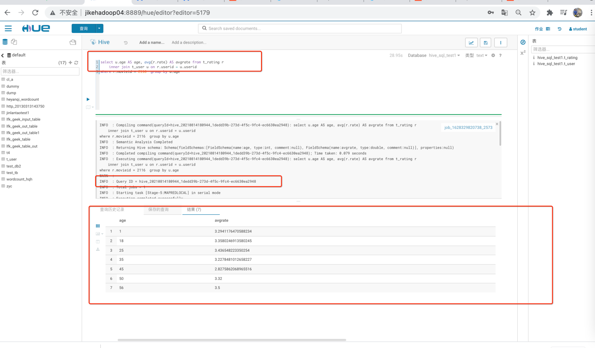

# 1 题目一
## 问题
> 展示电影ID为2116这部电影各年龄段的平均影评分

## 我的解答

```sql
select u.age AS age, avg(r.rate) AS avgrate from t_rating r
    inner join t_user u on r.userid = u.userid
where r.movieid = 2116  
group by u.age
```

截图


# 2 题目二

## 问题
> 中等：找出男性评分最高且评分次数超过50次的10部电影，展示电影名，平均影评分和评分次数

## 我的解答

### sql代码

```sql
select u.sex AS sex, m.moviename AS name, avg(r.rate) as avgrate, count(r.userid) as total
from t_rating r
         inner join t_user u on r.userid = u.userid
         inner join t_movie m on r.movieid = m.movieid
where u.sex = "M"
group by u.sex, m.moviename
having count(r.userid) > 50
order by avgrate desc
limit 10
```
### 截图


# 3 题目三

## 问题
> 困难：找出影评次数最多的女士所给出最高分的10部电影的平均影评分，展示电影名和平均影评分（可使用多行SQL

### sql代码

```sql
	with top_10_movie as (
    select t1.movieid as movieid, t1.rate as rate from t_rating t1
        inner join (select t_rating.userid, count(*) cnt from t_rating
                    inner join t_user
                    where t_user.sex = "F"
                    group by t_rating.userid
                    order by cnt desc
                    limit 1) AS t2 on t1.userid = t2.userid
    order by rate desc
    limit 10
)

select m.moviename as `t.moviename`, avg(r.rate) as `t.avgrate`
from top_10_movie 
    left join t_rating r on r.movieid = top_10_movie.movieid
    left join t_movie m on m.movieid = top_10_movie.movieid
group by m.moviename
order by `t.avgrate` desc
```


### 截图

8月14日晚上、15日凌晨跑，调试到一半，发现机器被回收了。
故没有了。麻烦老师看一下SQL和思路是否对哈

### 思路

1. 使用with as 定义一个子查询 `top_10_movie`评论对最多的女士的评分最高10个电影
2. 通过 top_10_movie、t_rating、t_moive join表查出这10个电影的平均评分，按从高到低排名